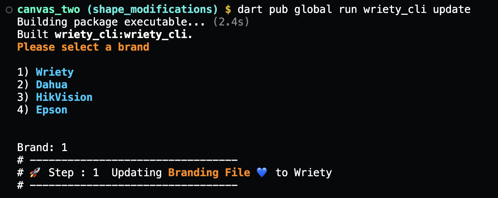
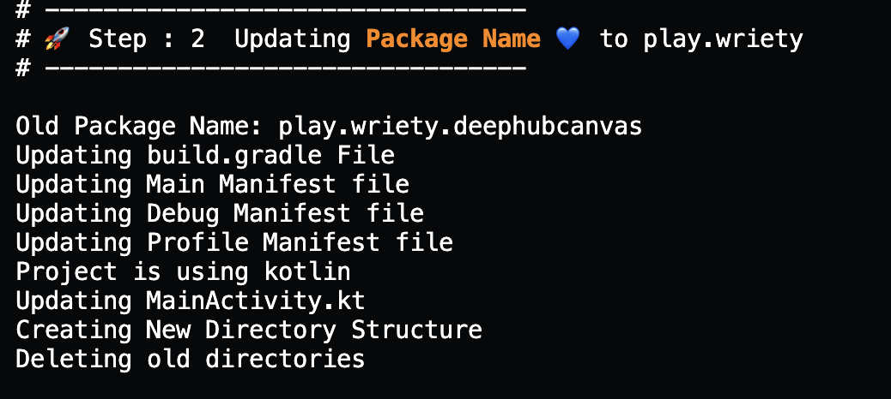
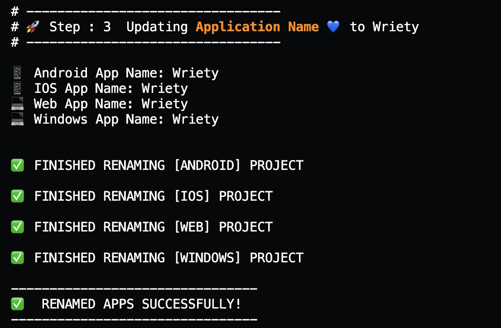
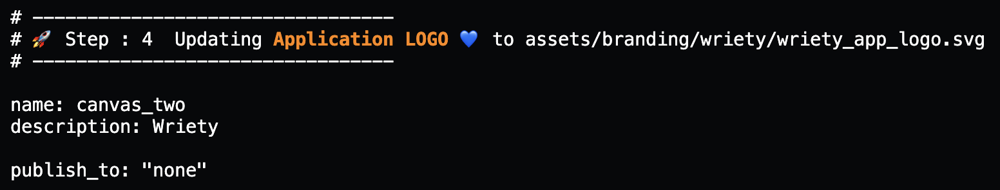
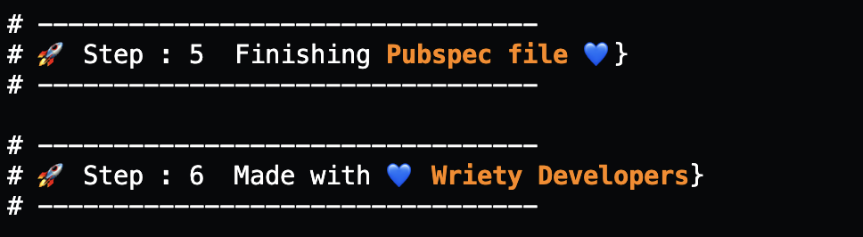

# Wriety CLI

A CLI tool for updating branding information.


Developed with 💙 by [Colladome](https://colladome.com/)💙


## Installing

```sh
dart pub global activate wriety_cli
```

## Commands

### `wriety_cli update`

Update branding of Wriety


## Screenshots









